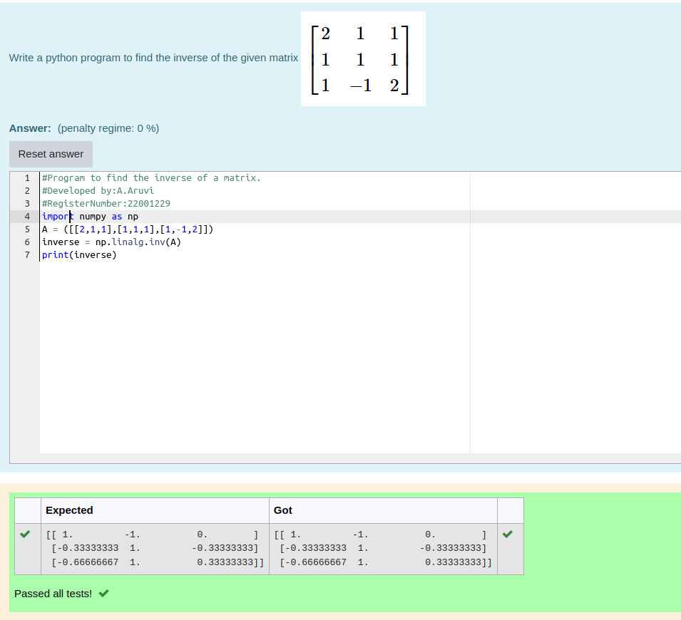

# INVERSE-OF-A-MATRIX

## Aim:

To write a python program to find the inverse of a matrix

## Equipment’s required:

1. 	Hardware – PCs
2. 	Anaconda – Python 3.7 Installation / Moodle-Code Runner

## Algorithm:

### Step1 : import numpy package
### Step 2: get the input matrix
### Step 3: find the inverse of matrix 
### Step 4: end the program

## Program:

```python
#Program to find the inverse of a matrix.
#Developed by:A.Aruvi 
#RegisterNumber:22001229
import numpy as np
A = ([[2,1,1],[1,1,1],[1,-1,2]])
inverse = np.linalg.inv(A)
print(inverse)
```

## Output:


## Result:

Thus the inverse of given matrix is successfully solved using python program

